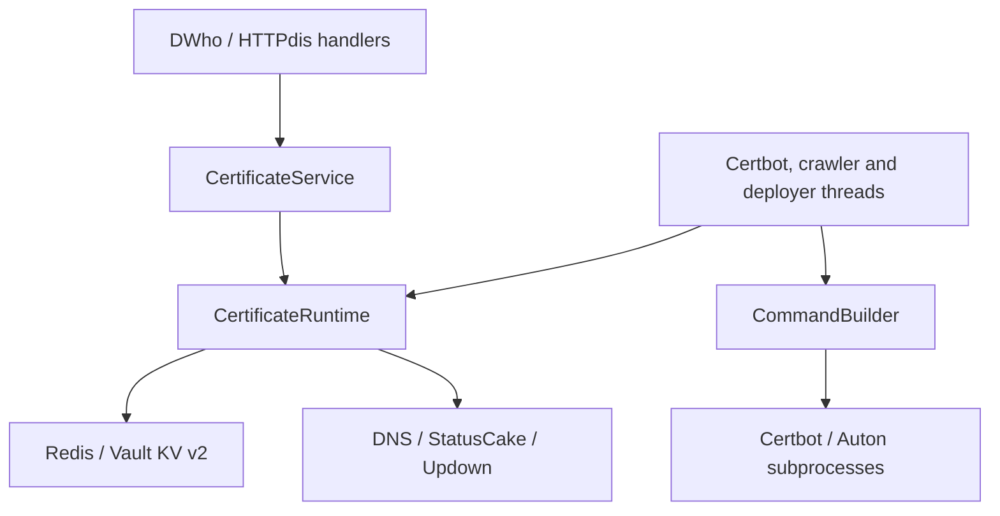
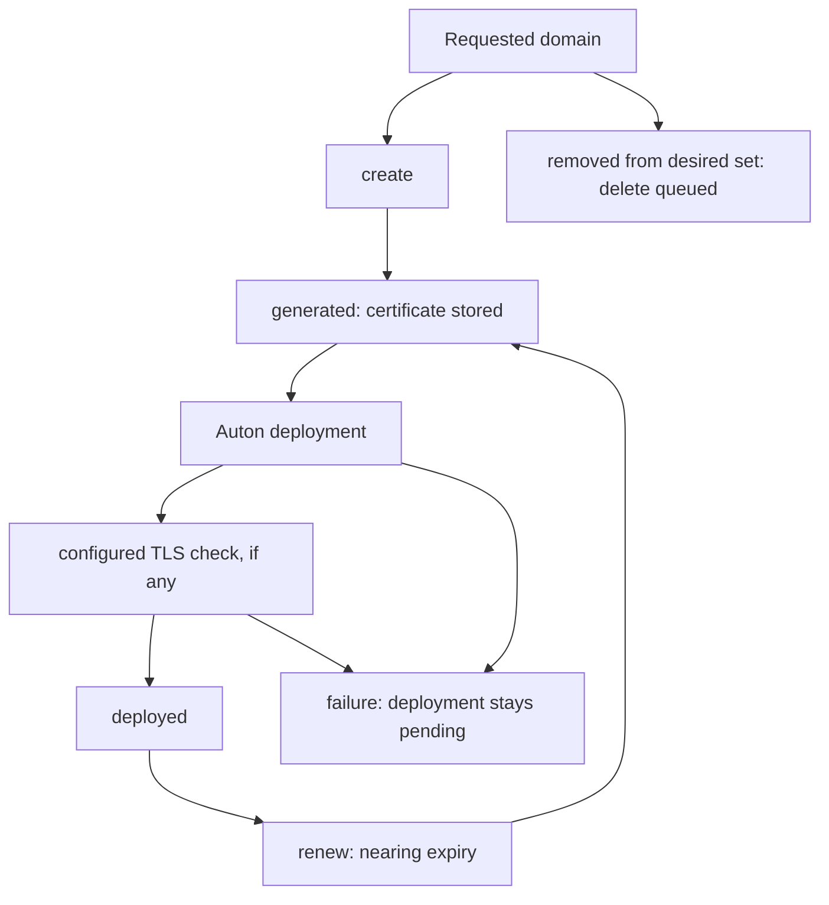

# Architecture

CertLord coordinates certificate issuance, renewal, deployment and monitoring.
The refactor separates request handling from application use cases and adapters.
Existing routes and certificate pending-state/reverse-index prefixes are retained;
configuration migration and new deployment identity/lease keys are documented in
`MIGRATION.md` and below.

## Responsibilities

- `modules/ssl_certs.py`: request schemas, HTTP error translation, lifecycle hooks
  and delegation of worker lifecycle to the application runtime.
- `services/certificates.py`: deploy, validate, save, upsert and index use cases.
  Accepts plain values, owns use-case locking and raises application exceptions.
  It does not import DWho, HTTPdis, Redis, Vault or a request object.
- `adapters/commands.py`: constructs argv and subprocess environments. It performs
  no I/O. Existing module command methods remain as forwarding methods.
- `classes/ssl_cert_auto_object.py`: pending certificate state and retry metadata.
- `classes/certbot_handler.py`: processes pending create/renew/delete operations.
- `classes/vault_crawler.py`: inspects Vault certificates, determines renewal
  needs and queues deployments.
- `classes/deployer.py`: executes Auton, optionally verifies one configured TLS
  destination and conditionally acknowledges the captured Vault version.
- `adapters/tls_verification.py` / `tls_probe.py`: configured, parent-bounded TLS
  handshakes; no API-supplied destination or insecure validation mode.
- `services/observations.py`: allowlisted certificate/operation metric projections.
- `adapters/operations.py`: read-only Redis queue/retry/lease observations.
- `services/runtime.py`: liveness and dependency/thread readiness. Thread liveness
  is not cycle-progress evidence; see the operations guide.
- `modules/letsencrypt.py`: ACME HTTP challenge CRUD through Redis. This transport
  has not yet been extracted into a separate service.

`services/runtime.py` composes worker-facing operations with injected storage,
pending state, DNS policy, commands and monitoring. Workers receive this runtime,
never an HTTP module. `composition.py` selects providers and validates startup.
`ports/certificates.py` defines storage and session contracts; Vault KV v2 and
Vault token/AppRole authentication are separate adapters. API identities and
permissions are independent of Vault credentials.

Historical StatusCake/Updown integration remains in CertLord. Expiry alert rules,
notifications and escalation belong to an external supervision system; CertLord exposes authenticated
certificate and operational observations for external collectors. Only explicitly enabled providers
are initialized, with separate instances for each runtime. Existing worker cycles
perform monitoring calls; no new thread is introduced. Disabled monitoring does
not require provider credentials. Provider connections are deferred to monitoring cycles. Finite positive request
timeouts are configurable; durable deletion retries and live provider acceptance
remain open. Monitoring can still delay a worker during network I/O.

## State flow

Redis holds pending operations and reverse domain/UUID links; Vault holds
certificate material. `exists`, `processing` and `invalid-dns` are also used.
A deployment error does not remove the Redis pending entry. This is not a
transaction across Redis, Vault and external monitoring providers.

## Concurrency and errors

Upsert holds `CERTIFICATES_LOCK` for one certificate UUID. Save holds the global write
lock; validate, index and deploy hold a read lock. Locks are process-local.
The inherited lock strategy does not guarantee exclusion between every worker
and HTTP operation, or between multiple CertLord processes.

Application errors map to HTTP 404 (missing domain/site association), 409
(DNS/CAA conflict) and 503 (busy). Transport validation retains 400 and 415.
Unexpected failures return a generic 503 without exception contents.

## Intentional behavior corrections

- Duplicate certificate calls now pass `(certificate_id, domain)` in that order.
- Desired domains are lowercased once before addition/deletion comparisons.
- All desired domains are checked before persistent upsert writes begin.
- Returned domain lists are sorted for deterministic responses.
- Save copies input data and returns 404 for an unknown domain association.
- Vault token authentication initializes unused AppRole fields to `None`.
- Command environment overrides no longer mutate cached Auton credentials.
- Invalid non-text ACME payloads return 415 instead of a regex TypeError.

Schema validation remains the responsibility of HTTP handlers. Non-HTTP callers
must provide already validated values to the application service.

## Worker deadlines and shutdown

`command_timeout` bounds each Certbot/Auton command (default 300 seconds).
Commands run in their own POSIX session. Timeout or worker interruption terminates
that process group, escalates to SIGKILL and reaps the direct child. The
`process_stop_grace` default is 2 seconds. Processes which leave the group are
outside this mechanism. Killing the local Auton CLI does not cancel a remote job;
its deployment remains pending and may require reconciliation before retrying.

Stop signals are set before waking workers. The Certbot interval wait is
interruptible. Runtime stop signals every worker first, then joins threads within
one `worker_stop_timeout` budget (default 10 seconds). Threads still blocked in
external I/O are reported; this does not forcibly terminate Python threads or
prove bounded provider/DNS/Redis calls. Subprocess creation itself is not bounded.
These process-control APIs target the tested Python 3.11/3.12 POSIX environments;
package metadata requires Python 3.11 or newer; later interpreters remain unvalidated.

An interrupted issuance keeps its pending entry without incrementing retries;
a command timeout consumes a retry. Interrupted/failed deployment is not
acknowledged. Cross-store atomicity and restart recovery remain separate gates.

## Deployment queue replay

Each newly queued certificate generation has a stable `deploy:<sha256>` identity
based on server, site, domain, certificate and chain. Repeated crawler passes for
the same generation reuse that identity and preserve its first queue timestamp.
Each Redis server receives the hash and set membership in one transaction;
acknowledgement removes both in one transaction after the Vault status update.
Existing UUID entries remain readable and are cleaned when acknowledged. Existing
duplicate UUIDs are not retroactively migrated, and old orphan hashes are not swept.

This is sequential replay deduplication, not exactly-once deployment. Redis and
Vault still have no shared transaction, and certificate replacement is protected by a Vault version check, while deployers
sharing a server ID coordinate through a Redis lease (see below). Multiple Redis servers are not
one atomic transaction. Redis transaction command errors do not provide rollback.
A timeout or restart may leave an Auton job running remotely; retries must use an
idempotent deployment endpoint or explicit reconciliation.

The acceptance scenario now checks repeated crawler cycles, API process
restart with a failed deployment still pending, successful recovery and hash
cleanup. The initial cases use explicit subprocess cycles. Additional acceptance now starts
all three workers through the real daemon and verifies controlled SIGTERM/restart
during issuance and deployment through served TLS. Abrupt crashes, blocked I/O and
arbitrary interleavings remain separate validation gates.

## Monitoring availability

Enabled provider configuration is validated without network calls during startup.
The first monitoring cycle connects and loads existing controls before creating or
deleting them. Connection/listing failures are logged without provider exception
contents and can be retried on the next cycle; other configured providers still
run. A successful initial listing is required before creating controls after restart.

Each provider accepts `timeout` in its YAML section (10 seconds by default). It is
passed to the SDK, not to the remote check configuration. This is the HTTP client
connect/read timeout, not a total wall-clock deadline across reconnects, multiple
requests or DNS resolution. Updown uses the tested timeout-capable client >=0.1.0.
StatusCake registration remains disabled; isolated adapter tests do not certify
its live API compatibility. Deletion retry persistence and concurrent access to
provider collectors remain open work.

## Deployment coordination and certificate versions

Deployers sharing the same `general.server_id` and Redis use an owner-token lease.
Exactly one Redis server is required for certificate state/coordination; unsupported
multi-Redis topology fails at startup. Lease duration is command timeout + three
stop-grace periods + 5 seconds; it is renewed during discovery and before command
launch and acknowledgement. A crashed owner stops renewing and Redis expires the
lease. Release and queue cleanup check the owner token atomically; an expired
owner cannot delete a successor's lock or acknowledge its queue entries.

Before launching Auton, each queued certificate is read with its Vault KV v2
version. On successful completion, the deployed status is written with CAS against
that same version. Any intervening write (including renewal) rejects the old
acknowledgement and retains the operation. A later pass requeues a superseding
generated certificate before removing its old-generation entry. Certificates no
longer eligible for deployment are skipped. Legacy UUID entries use the snapshot
read before the new command; they cannot reconstruct old historical generations.

Unknown/failed command outcomes retain the lease until expiry to delay retries.
This does not fence or cancel remote Auton jobs. A suspended worker, lost Redis
state/failover, or remote work surviving the lease can still produce overlapping
external effects. Exactly-once remote execution requires endpoint idempotency or
remote fencing/reconciliation. Redis ownership and Vault CAS are separate systems,
not one atomic transaction. Operators must use the same server ID/Redis for workers
coordinating the same deployment endpoint. Different IDs are separate lease scopes.

## Busy-site crawler retry

A save notification can arrive while the issuance worker still owns the site lock.
If a crawler pass skips a busy site, it retains a retry flag and uses the shorter
of its normal interval and the one-second busy retry interval on its interruptible
event wait. This prevents a consumed notification from postponing a generated
certificate until the next periodic scan. A successful scan clears the retry flag;
shutdown still wakes the existing event. This does not change the broader lock
boundaries or provide distributed exclusion for issuance.

## Pending removal precedence

When a crawler encounters a domain whose pending Redis operation is `delete`,
it preserves that operation even if the Vault certificate still says `deployed`.
It skips normal monitoring/renewal/deployment discovery and does not restore the
removed reverse association. This prevents a scan between an API removal request
and worker execution from undoing the removal.

The deletion worker retains the operation and increments retries when Vault refuses
deletion; an authorized retry destroys old certificate material and clears pending
state while preserving Vault metadata/version counters (see below). This is managed-store removal, not CA revocation or remote uninstall.
The initial acceptance starts without an in-flight deployment. The additional
controlled concurrent/shared-site cases below extend that coverage.

## Removal versus deployment and shared domains

An API removal first writes `status: delete` to the site's Vault record, then saves
the pending deletion and reverse associations in Redis. This advances the Vault
version seen by deployment CAS: a successful job using the earlier snapshot cannot
overwrite the removal marker. Failure to write that marker aborts the mutation.
The stores have no shared transaction: later failures can leave a marker which the
crawler discovers on its next scan.

A confirmed missing record during deployment discovery removes its obsolete queue
entry under the owner lease. Other storage errors retain work. Re-adding a record
still marked for deletion restores generated state when material is present, or
create state otherwise.

Both deletion workers delegate monitoring cleanup to the runtime. It removes the
domain control only when the reverse index contains no other site; deletion also
repairs this site's stale association. This relies on the current index and does
not provide atomic cross-process membership changes or durable provider retries.

The fixture covers removal requested during an already-running Auton job,
two sites sharing material and restoration from the remaining copy. It has one
actual TLS endpoint. Remote effects may still finish; nothing here cancels jobs or
uninstalls/revokes certificates. Multi-process reverse-index races, partial saves,
save-versus-removal and metadata deletion/recreation during deployment remain open.

## Conditional save and partial fan-out

Save preflights all current reverse-index targets with versioned Vault reads.
A missing target returns application 404, and a target marked for removal returns
409, before any write. Each subsequent target write uses the captured version CAS;
a conflicting concurrent mutation returns application 409. Save never falls back
to unconditional creation after conflict or absence.

After write attempts, the crawler is notified even if a later target fails.
Previously completed writes remain stored; the caller receives an error and must
reconcile/retry. The notification is in-memory, while generated records remain
discoverable by later scans. Retrying identical certificate/key/chain/vendor
material already generated or deployed skips that target, preserving its version
and deployed state. Other states still require a conditional write.

This is not atomic multi-site commit or automatic completion of the failed targets.
It protects mutations after a snapshot, but has no issuance-generation token to
reject old callbacks which begin later. Vault metadata deletion/recreation can
reset versions; reverse-index concurrency and that ABA case remain separate gates.

## Material destruction without resetting versions

Managed removal uses a versioned snapshot and CAS to write a material-free
`delete` marker. It then reads metadata and permanently destroys retained versions
at or below the original snapshot. A final CAS writes `status: removed`.
Completed markers are hidden from managed reads and inventory; incomplete markers
remain visible for retry. Inventory therefore reads listed records, increasing
Vault calls compared with metadata-only listing.

The metadata and version counter remain. Recreation advances that counter, so
pre-removal save/deployment snapshots cannot regain validity through version reuse.
Errors do not acknowledge deletion; a failed destruction can temporarily leave old
versions readable while its retry marker is visible. No certificate/key material
is copied into either marker. Domain/site path names remain in Vault.

This supersedes the earlier adapter behavior of deleting all metadata. Update the
AppRole policy and stop old workers before rollout. Administrators must not delete
managed metadata behind active workers: that would reset the counter again.
This protection does not identify late issuance callbacks, make reverse-index
changes atomic, or solve every concurrent deletion/re-add ordering.

## Issuance attempt identity

Before launching the ACME client, the service preflights current reverse-index
targets and conditionally binds a random 64-hex attempt identity to each Vault
record. The command starts only after all bindings succeed. Save requires that
identity on every target snapshot, then applies the existing CAS writes. Completed
attempts accept only identical material on replay; newer attempts supersede older
ones. Deletion clears the identity, and copying material to a new site strips it.
Existing pre-identity callbacks fail closed with HTTP 409.

The command adapter loads the configured installer YAML, preserves its credentials
and options, and writes a private temporary copy containing `X-CertLord-Issuance`.
The HTTP handler extracts the header; validation and acceptance stay in the service.
API authentication remains separate. The identity has no TTL and is not a durable
record of subprocess cancellation. Partial multi-site binding can leave different
identities, causing rejection until a new attempt reconciles them.

## Atomic reverse-site mutations

Lifecycle callers use a Redis Lua operation to add/remove only their site ID,
preserving other members atomically. The crawler mutates membership while holding
its site lock, rather than deferring a stale whole-list write. The UUID branch changes the JSON field names, including an empty `certificate_ids: []`; whole-index replacement is
retained only for controlled maintenance/fixtures.

The operation is atomic inside Redis, not across Redis/Vault/monitoring. Same-site
lifecycle locks remain process-local; multi-active issuers/deleters are not certified.
Use one active lifecycle daemon for a state scope. Cross-process deployment leases
do not make the entire lifecycle safe for multiple active daemons.

## Stable certificate identity and terminal clients (2026-10-02)

Every managed UUID binds one domain; the
service rejects multiple domains and domain reassignment before mutation. Vault
metadata listing, including removed paths, retains that binding after removal.
Renewal updates material/version/status under the same UUID. Pre-existing duplicate UUIDs can share a domain and copied material; the reverse
index coordinates those associations, not organizations or tenants. New POST
creation uses the canonical identity index described below.

`services/certificate_ids.py` defines UUID syntax and deterministic selector
resolution. `CertificateService` exposes summary inventory without secrets. The
HTTP module owns schemas and authorization. `client/api.py` supplies bounded,
verified HTTP access; `client/cli.py` dispatches explicit non-interactive commands.
`client/tui.py` is imported only for an explicit terminal invocation and reuses
DWho rendering/detail helpers. Text truncation is presentation only: API, storage
and JSON use full UUIDs. A domain/prefix collision is an error, never a first-match
selection. See [the HTTP and terminal contract](certificate-identity.md).

Locks, queues and association fields use certificate IDs. Multi-SAN issuance
remains outside the current model.

## Canonical identity index and bounded backend calls

Certificate creation normalizes lowercase ASCII domain names, removes the DNS root
suffix, deduplicates and sorts the set, then serializes
`{"domains":[...],"version":1}` with sorted keys and compact JSON separators.
Its SHA-256 is an internal lookup key, not an authentication credential or the UUID.
No private key, PEM, secret or HMAC enters this definition. The current issuer still
accepts only one distinct domain; multi-SAN issuance remains unfinished.

Vault stores the definition, fingerprint and server-generated UUID under
`<key_name>/_identities/<sha256>`. The first reservation uses KV v2 CAS=0. A losing
reservation reads and compares the stored definition, then reuses the winner.
Repeated creation finds the existing certificate without replacing its material.
The index survives Redis loss and API restarts; it is not a transaction with Redis
or certificate storage. Failed creation may leave a reservation which is reused on
retry. An existing `create` record is reconciled with pending state on retry.
A removed identity is retained and cannot be resurrected through ordinary creation.
Back up index records with certificate data; do not delete their Vault metadata.
A missing index adopts one matching existing UUID; multiple matches require explicit
reconciliation. This scan is only on an index miss. HTTP PUT only updates/restores an existing identity; an unknown client-selected
UUID is rejected with 404. Only POST creation reserves identities. Multi-active
lifecycle safety remains outside these guarantees.

DNS resolution and CAA ancestor traversal each have a shared `dns_timeout` budget
(default 5 seconds). Unavailable nameservers and timeouts fail closed with a sanitized
503, instead of being interpreted as absent CAA. NXDOMAIN/NoAnswer retain the existing
parent-lookup behavior. Two policy checks can consume two budgets.

Both Redis scopes use the DWho adapter interface with finite redis-py socket read
and connect timeouts (default 5 seconds each). Set these in the Redis URL query as
`socket_timeout` and `socket_connect_timeout`; nonpositive/nonfinite values fail
configuration. Automatic transport retries are disabled: an uncertain mutation is
not silently replayed. A timeout does not prove the server did not apply the write.
These are socket waits, not a total operation deadline: hostname resolution, multiple
commands, slow-trickle replies, lock waits and worker draining have separate limits.

Challenge publication uses the DWho adapter's atomic Redis SETEX operation with
`modules.letsencrypt.challenge_ttl` (default 3600 seconds). DELETE remains the normal
cleanup path. Expiry bounds orphan retention if the client or API stops before
cleanup; it is not immediate cancellation and does not migrate preexisting keys
without an expiry. Challenge lifetime should exceed the expected validation duration.

Monitoring create/delete calls are not immediately replayed on a connection error:
the provider may already have committed the request. A failed or uncertain mutation
invalidates the service's discovery state, so the next operation first lists the
provider's controls again. This reduces duplicate creation after lost replies when
listing exposes the committed control; it is not exactly-once execution, protection
against stale provider listings, or durable deletion retry after certificate removal.
Read-only discovery retains its bounded SDK request behavior. StatusCake remains
unregistered; its mutation replay behavior is covered only by isolated tests.

The retained Debian systemd unit allows 30 seconds before forced termination;
the SysV script uses TERM/30/KILL/5. The earlier 5-second service-manager limit
could preempt the default 10-second worker-join budget. Operators increasing
`worker_stop_timeout` must increase their supervisor's stop deadline accordingly.
This aligns the defaults; Debian installation and supervisor-driven lifecycle
acceptance remain separate from the direct-daemon tests.

## Current operational scope

CertLord supports stored-certificate observations and optional
post-deployment TLS results, plus authenticated health and current work reads.
These reads do not reset retries,
repair queues or reveal lease ownership tokens. Queue scans are bounded by an item
cap, not a global latency guarantee, and are not transactional snapshots across
Vault and Redis. See [the runbook](operations.md).

Single-active lifecycle operation remains the supported acceptance scope. Remote
jobs may survive local commands; TLS verification does not introduce remote
fencing or automatic rollback.

## Scheduler cycle evidence

Composition injects `CycleProgress` and the Redis `CycleProgressStore` into the
runtime. Thread loops call the observer around existing cycle callbacks. This
leaves certificate state transitions in their existing services/adapters. Fixed
per-worker records retain current and previous-instance evidence; conditional
completion protects newer cycles from late writes. Persistence failures do not
become operation failures, and observations do not interpret cycle return as
certificate success. See [operations](operations.md) for durability and timing
limits; this is not distributed execution coordination or a complete audit log.
