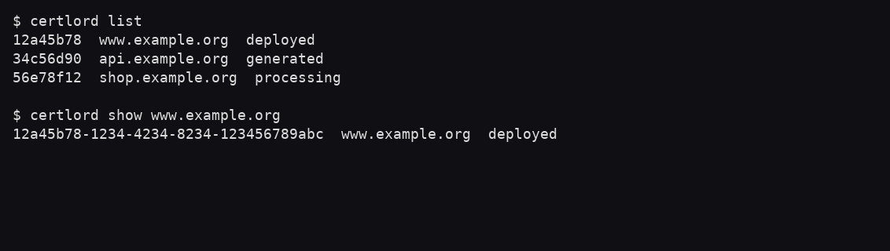
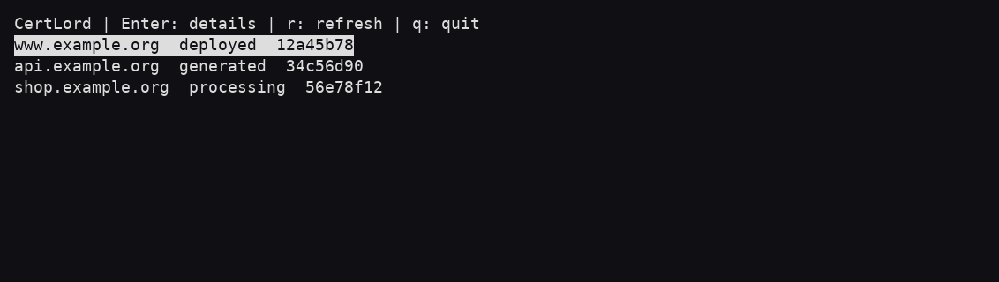
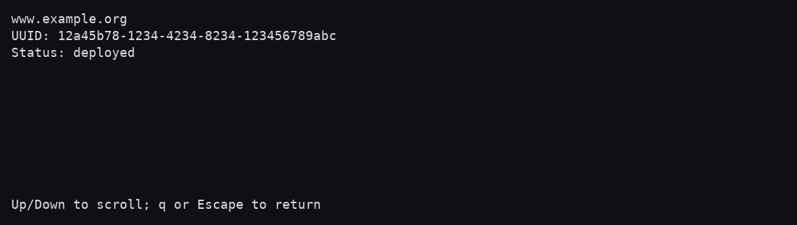

# CLI and terminal browser

These captures run the real CertLord 1.0.0 client against a read-only HTTP
fixture on loopback. Domains, UUIDs and statuses are synthetic demonstration data.
They illustrate the interface, not successful issuance or deployment. No Vault,
Redis, private keys, credentials or production hosts are involved.

## Scriptable commands

`certlord list` shows a compact UUID, domain and lifecycle status. `certlord show
www.example.org` resolves the domain and returns the full UUID. Use `--json` for
scripts and cron; commands never enter the terminal browser automatically.
[Text transcript](images/cli-certificates.txt).

## Read-only terminal inventory

Launch `certlord tui` explicitly in an interactive terminal. Use arrow keys to
select, Enter for details, `r` to refresh and `q` to exit. The reversed row marks
the selection; it is not an error. The browser cannot create, replace or delete
certificates. [Text transcript](images/tui-inventory.txt).

## Certificate detail

The current detail screen shows the domain, full UUID and status. `q` returns to
the list. `deployed` is a lifecycle status, not by itself proof of a current TLS
check; see [destination verification](tls-verification.md).
[Text transcript](images/tui-details.txt).

For capture generation and maintenance, see the
[contributor guide](contributing.md#reproduce-the-captures).

## Textual browser

The [Textual guide](textual.md) shows the current optional browser with synthetic fixtures.
The curses captures above document the compatibility interface.
