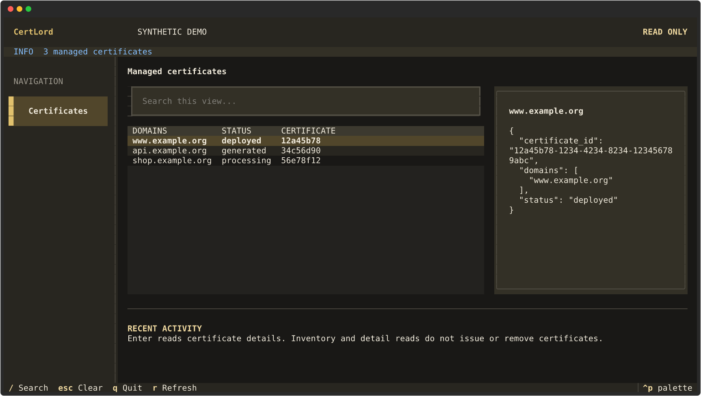
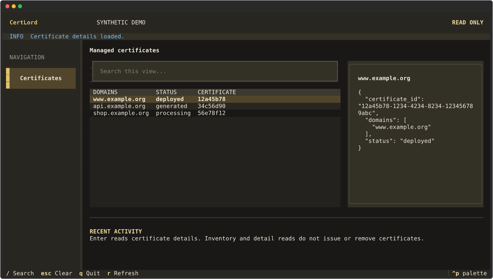

# Textual terminal interface

The Textual interface uses a gold and charcoal palette with DWho 0.3.66 or newer.
Navigation, tables and dialogs share the product colors. Labeled status colors
remain consistent across products: blue acceptance, violet in progress, green
success, amber warning or uncertainty, and red failure.

Install the optional extra with `pip install "certlord[textual]"`.

Run `certlord tui --ui textual`. Search the managed certificate inventory,
press Enter to read a certificate, and r to refresh. This browser is read-only;
issuing, importing, replacing and removing certificates remain CLI/API operations.
Failed reads leave the previous inventory visibly marked as stale.

Use / to search, Escape to cancel dialogs and q to quit. Requests run off the
UI thread; wait for pending requests before closing. The curses interface remains
available with `--ui curses`. Synthetic demonstrations are not production evidence.

## Synthetic interface examples

